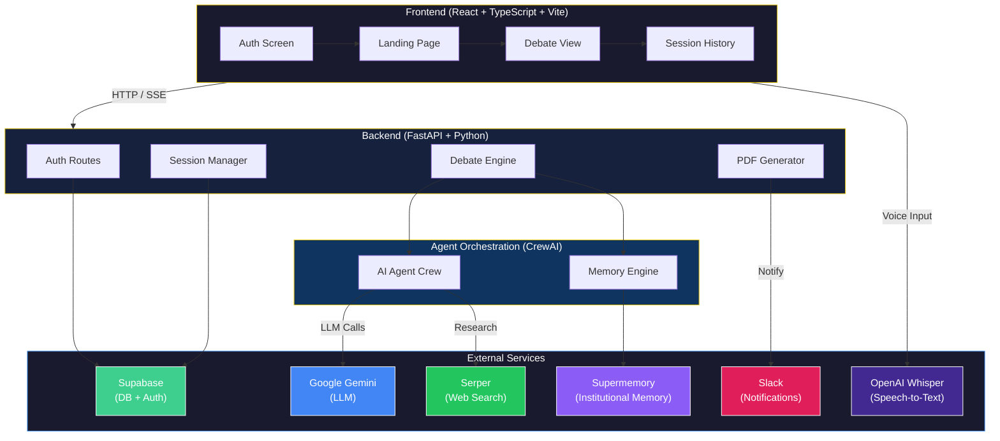
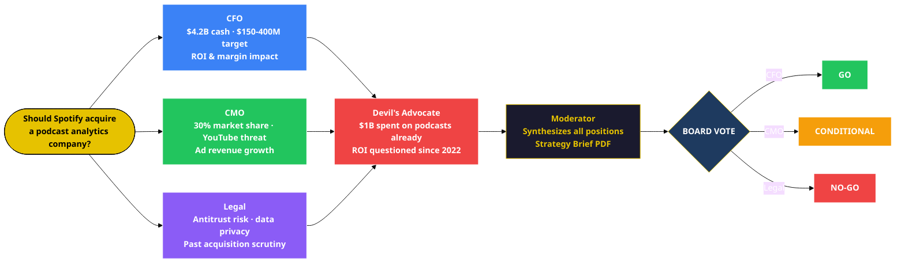
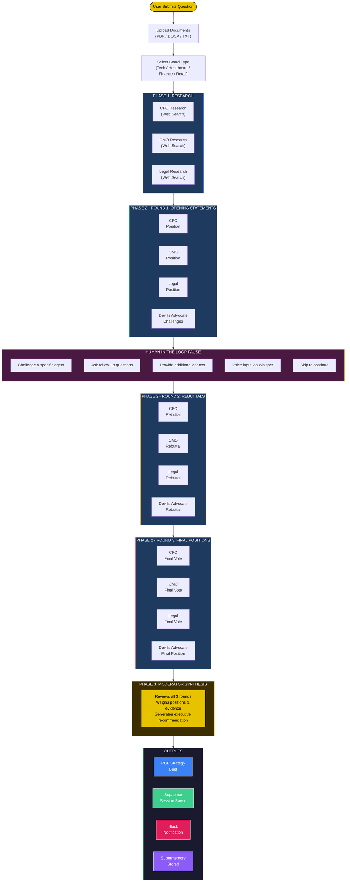
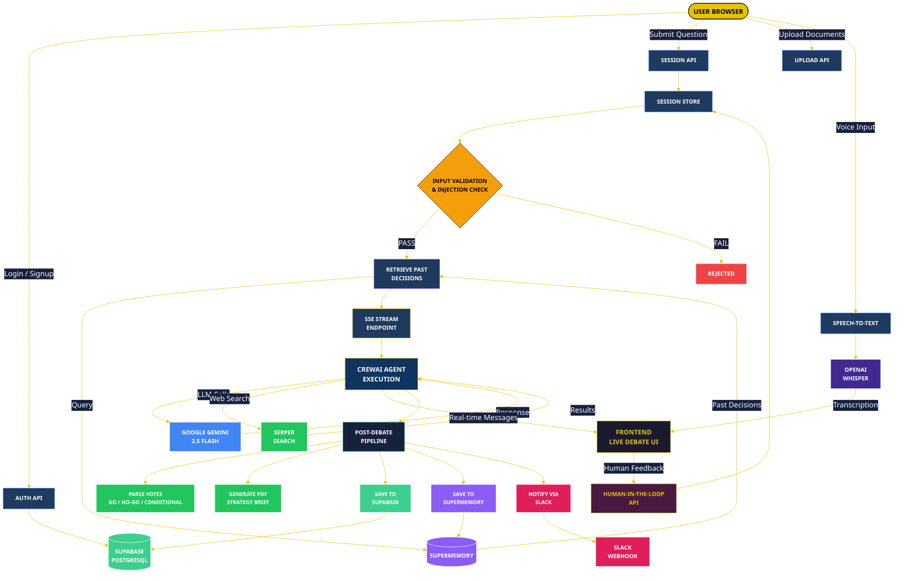

<p align="center">
  
  
  
  
  
</p>

<h1 align="center">Shadow Board</h1>
<h3 align="center">AI-Powered Executive Decision Simulation Platform</h3>

<p align="center">
  <i>Simulate a boardroom of AI executives debating your strategic questions in real-time.</i>
</p>

<p align="center">
  <a href="https://www.youtube.com/watch?v=Eq9tkcItfrM">
    
  </a>
  &nbsp;
  <a href="https://youtu.be/t4cJPGrKRw8">
    
  </a>
</p>

---

## Demos

### Full Application Demo

<p align="center">
  <a href="https://www.youtube.com/watch?v=Eq9tkcItfrM">
    
  </a>
  <br/>
  <em>Click to watch the full Shadow Board application demo on YouTube</em>
</p>

### AIRIA Catalogue Interface Demo

<p align="center">
  <a href="https://youtu.be/t4cJPGrKRw8">
    
  </a>
  <br/>
  <em>Click to watch the AIRIA Catalogue Interface Demo on YouTube</em>
</p>

---

## What is Shadow Board?

**Shadow Board** is an intelligent boardroom simulation platform that assembles a panel of AI executive agents — each with distinct expertise, perspectives, and debate styles — to rigorously analyze your strategic business questions from every angle.

Instead of relying on a single AI response, Shadow Board orchestrates a **multi-agent debate** across research, argumentation, and synthesis phases, producing a comprehensive **Strategy Brief PDF** with actionable recommendations.

### The Problem It Solves

| Traditional Approach | Shadow Board Approach |
|---|---|
| Single-perspective AI answers | Multi-agent debate from 5 expert viewpoints |
| No structured analysis | 3-phase research + debate + synthesis pipeline |
| Static one-shot responses | Real-time streaming with human intervention |
| No institutional memory | Learns from past decisions via Supermemory |
| Generic advice | Domain-specific boards (Tech, Healthcare, Finance, Retail) |

---

## Key Features

- **Multi-Agent Debate Engine** — 5 AI executives (CFO, CMO, Legal Counsel, Devil's Advocate, Moderator) powered by Google Gemini debate your question through 3 structured rounds
- **Human-In-The-Loop (HITL)** — Pause the debate mid-round to challenge agents, ask follow-ups, or redirect the discussion with text or voice input
- **Real-Time Streaming** — Watch the debate unfold live via Server-Sent Events (SSE) with agent-by-agent responses
- **Domain-Specific Boards** — Choose from Tech, Healthcare, Finance, or Retail presets that customize each agent's expertise
- **Strategy Brief PDF** — Auto-generated executive summary with board votes (GO / NO-GO / CONDITIONAL), risk matrix, and recommendations
- **Institutional Memory** — Past debate outcomes are stored and retrieved via Supermemory, so the board references prior decisions
- **Document Upload** — Feed the board PDF, DOCX, or TXT files for data-driven analysis
- **Voice Input** — Speech-to-text via OpenAI Whisper for hands-free human intervention
- **Session History** — Review, compare, and re-run past boardroom sessions
- **Slack Notifications** — Get notified in Slack when a debate completes with vote results
- **AIRIA Chat Widget** — Embedded AI assistant to explain features and answer questions

---

## System Architecture



---

## Agent Architecture — Example

> **Scenario:** *"Should Spotify acquire a podcast analytics company?"*



---

## Debate Flow & Phases



---

## Data Flow Diagram



---

## Tech Stack

### Frontend

| Technology | Purpose |
|---|---|
| **React 18** | UI framework |
| **TypeScript** | Type safety |
| **Vite** | Build tool & dev server |
| **Tailwind CSS** | Utility-first styling |
| **shadcn/ui** | Component library (45+ components) |
| **Framer Motion** | Animations & transitions |
| **React Router** | Client-side routing |
| **TanStack Query** | Server state management |
| **React Hook Form + Zod** | Form validation |
| **React Markdown** | Render agent responses |
| **Recharts** | Data visualization |
| **Lucide Icons** | Icon system |

### Backend

| Technology | Purpose |
|---|---|
| **FastAPI** | High-performance async API framework |
| **CrewAI** | Multi-agent orchestration framework |
| **Google Gemini 2.5 Flash** | LLM powering all agents |
| **SerperDev** | Real-time web search for research phase |
| **Supabase** | PostgreSQL database + authentication |
| **Supermemory** | Institutional memory for past decisions |
| **OpenAI Whisper** | Speech-to-text for voice input |
| **fpdf2** | PDF strategy brief generation |
| **PyMuPDF + python-docx** | Document parsing (PDF, DOCX) |
| **Uvicorn** | ASGI server |

### Infrastructure

| Technology | Purpose |
|---|---|
| **Render** | Cloud deployment |
| **Supabase** | Managed PostgreSQL + Auth |
| **Slack Webhooks** | Completion notifications |
| **AIRIA Platform** | Optional chat widget integration |

---

## Project Structure

```
airia-ai/
├── frontend/                      # React + TypeScript frontend
│   ├── src/
│   │   ├── pages/
│   │   │   └── Index.tsx          # Main app (auth, landing, debate UI)
│   │   ├── components/
│   │   │   ├── MessageCard.tsx    # Agent message renderer
│   │   │   ├── HumanInputPanel.tsx# HITL input interface
│   │   │   ├── PhaseIndicator.tsx # 6-phase progress bar
│   │   │   ├── TypingIndicator.tsx# Loading animation
│   │   │   ├── AiriaChatWidget.tsx# Embedded AI chat assistant
│   │   │   └── ui/               # 45+ shadcn/ui components
│   │   ├── hooks/
│   │   │   └── useSpeechRecognition.ts  # Whisper voice input
│   │   └── lib/                   # Utilities
│   ├── package.json
│   ├── vite.config.ts
│   └── tailwind.config.ts
│
├── server.py                      # FastAPI main server
├── agents_creation.py             # CrewAI agent definitions & tasks
├── database.py                    # Supabase auth & session storage
├── memory.py                      # Supermemory integration
├── pdf_generator.py               # Strategy brief PDF generation
├── slack_notify.py                # Slack webhook notifications
├── airia_client.py                # AIRIA platform integration
├── requirements.txt               # Python dependencies
├── render.yaml                    # Render deployment config
└── reports/                       # Generated PDF strategy briefs
```

---

## Getting Started

### Prerequisites

- **Python 3.11+**
- **Node.js 18+**
- **npm** or **yarn**

### 1. Clone the Repository

```bash
git clone https://github.com/your-username/airia-ai.git
cd airia-ai
```

### 2. Backend Setup

```bash
# Create virtual environment
python -m venv venv
source venv/bin/activate  # On Windows: venv\Scripts\activate

# Install dependencies
pip install -r requirements.txt
```

### 3. Frontend Setup

```bash
cd frontend
npm install
```

### 4. Environment Variables

Create a `.env` file in the root directory:

```env
# Required - Core APIs
GEMINI_API_KEY=your_google_gemini_api_key
SERPER_API_KEY=your_serper_api_key

# Required - Database & Auth
SUPABASE_URL=your_supabase_project_url
SUPABASE_ANON_KEY=your_supabase_anon_key
SUPABASE_SERVICE_KEY=your_supabase_service_key

# Required - Institutional Memory
SUPERMEMORY_API_KEY=your_supermemory_api_key

# Optional - Voice Input
OPENAI_API_KEY=your_openai_api_key

# Optional - Notifications
SLACK_WEBHOOK_URL=your_slack_webhook_url

# Optional - AIRIA Chat Widget
AIRIA_PIPELINE_ID=your_pipeline_id
AIRIA_WIDGET_API_KEY=your_widget_api_key
AIRIA_API_KEY=your_airia_api_key
```

### 5. Run the Application

**Start the backend:**

```bash
uvicorn server:app --reload --port 8000
```

**Start the frontend (in a new terminal):**

```bash
cd frontend
npm run dev
```

The app will be available at `http://localhost:8080` (frontend) and `http://localhost:8000` (API).

---

## API Reference

| Method | Endpoint | Description |
|---|---|---|
| `POST` | `/api/auth/signup` | Register a new user |
| `POST` | `/api/auth/login` | Authenticate user |
| `POST` | `/api/session/create` | Create a new debate session |
| `POST` | `/api/{session_id}/upload` | Upload document (PDF/DOCX/TXT) |
| `GET` | `/api/{session_id}/agents_research` | Start debate (SSE stream) |
| `POST` | `/api/{session_id}/human_input` | Submit HITL feedback |
| `GET` | `/api/{session_id}/download_pdf` | Download strategy brief PDF |
| `GET` | `/api/sessions/history/{user_id}` | Get user's session history |
| `POST` | `/api/speech-to-text` | Transcribe audio via Whisper |
| `POST` | `/api/chat` | AIRIA chat widget proxy |

---

## How It Works

1. **Authenticate** — Sign up or log in via Supabase
2. **Ask a Question** — Enter a strategic business question (e.g., *"Should we expand into the European market?"*)
3. **Select Board Type** — Choose from Tech, Healthcare, Finance, or Retail to customize agent expertise
4. **Upload Context** *(optional)* — Attach relevant documents for data-driven analysis
5. **Watch the Debate** — AI agents research, take positions, and debate in real-time
6. **Intervene** — During the HITL pause, challenge agents or provide additional context
7. **Receive Strategy Brief** — Download a PDF with executive summary, board votes, and recommendations

---

## Deployment

The project is configured for deployment on **Render** via `render.yaml`:

```bash
# Deploy to Render
# Push to your GitHub repo, connect to Render, and it auto-deploys

# Manual deployment
uvicorn server:app --host 0.0.0.0 --port $PORT
```

---

## Security

- **Input Validation** — Question length limits and prompt injection detection
- **Authentication** — Supabase Auth with email/password
- **API Key Protection** — All sensitive keys stored as environment variables
- **CORS** — Configurable cross-origin resource sharing
- **Session Isolation** — Each debate session is scoped to authenticated users

---

## Contributing

1. Fork the repository
2. Create your feature branch (`git checkout -b feature/amazing-feature`)
3. Commit your changes (`git commit -m 'Add amazing feature'`)
4. Push to the branch (`git push origin feature/amazing-feature`)
5. Open a Pull Request

---

## License

This project is proprietary. All rights reserved.

---

<p align="center">
  <b>Built with CrewAI + Google Gemini + React</b>
  <br/>
  <sub>Powered by AIRIA</sub>
</p>
